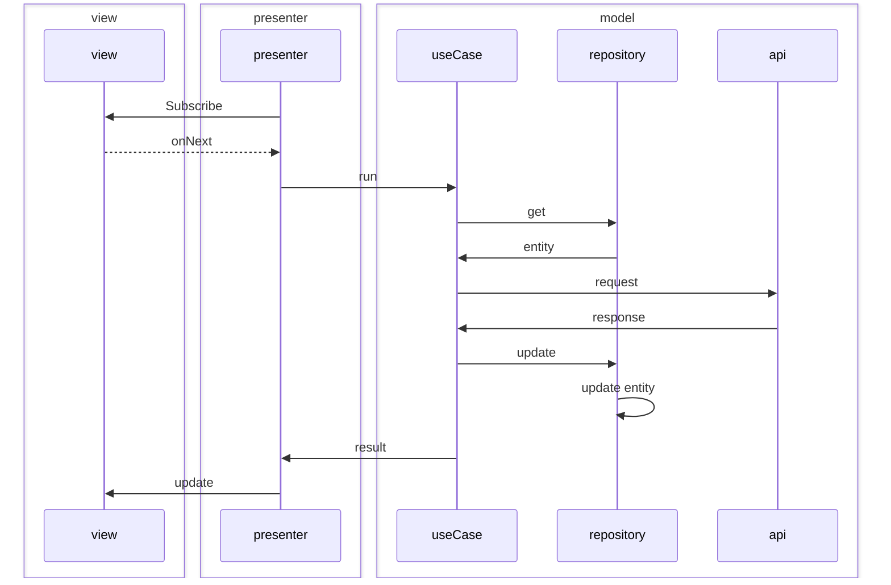
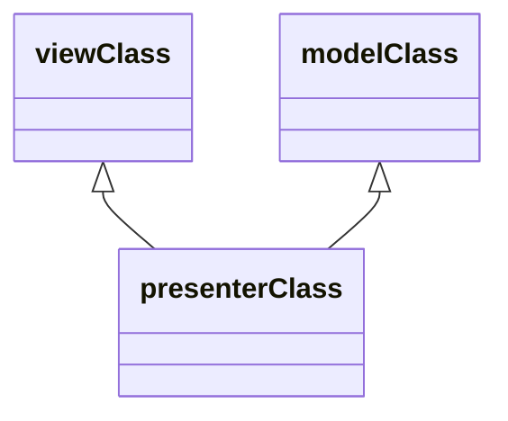

```mermaid
sequenceDiagram
box view
    participant view
end
box presenter
    participant presenter
end
box model
    participant useCase
    participant repository
    participant api
end
    presenter ->> view: Subscribe
    view -->> presenter: onNext
    presenter ->> useCase: run
    useCase ->> repository: get
    repository ->> useCase: entity
    useCase ->> api: request
    api ->> useCase: response
    useCase ->> repository: update
    repository ->> repository: update entity
    useCase ->> presenter: result
    presenter ->> view: update
    

```
  
# 基礎クラス図

```mermaid
classDiagram
viewClass <|-- presenterClass
modelClass <|-- presenterClass
```

# 詳細クラス図

```mermaid
classDiagram
Jspreadsheet <.. SpreadsheetView
IObservable <.. SpreadsheetView


namespace librariesGroupe{
    class Jspreadsheet
}

Observable <.. IObservable
namespace otherGroupe{
    class IObservable{
        +Observable observable
    }
    class Observable {
        +constructor() 
        +subscribe(func) 
        +unsubscribe(func)
        +notify(data) 
    }
    class EncryptString{
        +password_generate_key()
        +auto_generate_key()
        +import_secret_key(exportedSecretKey)
        +getKey(passphrase, salt = null)
        +getFixedField()
        +getInvocationField()
        +encrypt_string(secretKey, src_string)
        +decrypt_string(secretKey, encryptedResult)
    }

    
    class DynamicGenerationInterface{
        +function Generate(arg)
    }
}

namespace viewGroupe{
    class SpreadsheetView{
        +Observable observable
    }
}
SpreadsheetView <.. MainPresenter

namespace presenterGroupe{
    class MainPresenter{
        TaskDataRepository TaskData
        DataTemplateRepository dataTemplate
    }
}


MainPresenter ..> SetTaskDataChangeCallbackUseCase
MainPresenter ..> SetDataTemplateChangeCallbackUseCase

IObservable <.. SpreadsheetView

IUseCase <|-- SetTaskDataChangeCallbackUseCase
IUseCase <|-- SetDataTemplateChangeCallbackUseCase


SetTaskDataChangeCallbackUseCase ..> DataTemplateRepository
SetDataTemplateChangeCallbackUseCase ..> DataTemplateRepository
namespace useCaseGroupe{
    class IUseCase{
        +run(arg)
    }


    
    class DataTemplate2TaskDataUseCase{
        +run(arg)
    }

    class saveLocalStrage{
        +run(arg)
    }
    class loadLocalStrage{
        +run(arg)
    }
    class SetDataTemplateMemberUseCase{
        +run(arg)
    }
    class SetTaskDataMemberUseCase{
        +run(arg)
    }
    
    class SetDataTemplateChangedCallbackUseCase{
        +run(arg)
    }
    class SetTaskDataChangedCallbackUseCase{
        +run(arg)
    }
    class SetDataTemplateLoadCallbackUseCase{
        +run(arg)
    }
    class SetTaskDataLoadCallbackUseCase{
        +run(arg)
    }
    class SetTaskDataInsertedCallbackUseCase{
        +run(arg)
    }

    class DataTemplate2TableHeaders{
        +run(arg)
    }
    class TaskData2TableData{
        +run(arg)
    }
}


namespace repositoryGroupe{
    class DataTemplateRepository{
        +Observable observable
        +DataTemplateEntity[] DefaultDataTemplate
        +DataTemplateEntity[] DataTemplate
    }
    class TaskDataRepository{
        +TaskDataEntity[] TaskData

        +Observable observable
    }
}
TaskDataEntity "1"..> "*" TaskDataTemplate
DataTemplateEntity ..>  TaskDataTemplate
DataTemplateEntity ..>  TableDataTemplate
TaskDataRepository "1"..> "*" TaskDataEntity
DataTemplateEntity ..>  JspreadsheetDataTemplate
DataTemplateEntity ..>  TaskUiTemplate
DataTemplateRepository "1" --> "*" DataTemplateEntity

TaskDataRepository ..>  IObservable
DataTemplateRepository  -->  IObservable

TaskDataRepository ..> DynamicGenerationInterface
EncryptString ..> EncryptedResultEntity

namespace entityGroupe{
    class TaskDataEntity{
        <<anonymous class>>
    }
    class TaskDataTemplate{
        +member
        +defaultValue
    }
    class DataTemplateEntity{
        <<anonymous class>>
        +taskDataTemplate taskDataTemplate
        +jspreadsheetDataTemplate jspreadsheetDataTemplate
        +tableDataTemplate tableDataTemplate
    }
    class TaskUiTemplate{
        <<anonymous class>>
        +title
    }
    class TableDataTemplate{
        <<anonymous class>>
        +type
        +width
        +colNum
        +readOnly
    }
    class JspreadsheetDataTemplate{
        <<anonymous class>>
        +editor
        +source
        +options
    }
    class EncryptedResultEntity{
        +data
        +iv
    }
}
```
